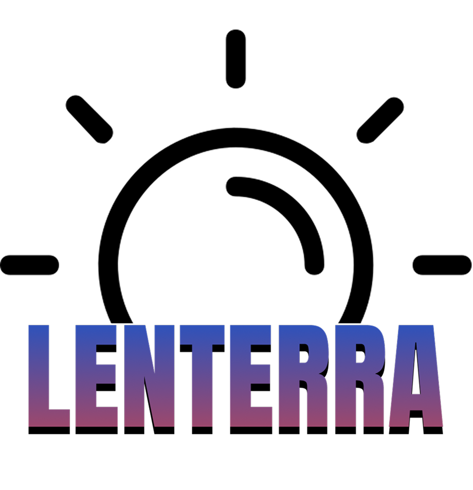

# Lenterra

## 🌟 About Lenterra

Lenterra is an innovative digital learning platform that integrates traditional Indonesian games with STEM education and digital skills through gamification. Designed to improve education access and quality for middle and high school students in Indonesia, Lenterra addresses educational disparities between rural and urban areas.

## 🎯 Our Mission

To reduce school dropout rates and enhance learning motivation by creating an engaging, culturally relevant educational experience that bridges traditional knowledge with modern skills development.

## ✨ Key Features

### 🎮 Culture-Based Gamification
- Digital adaptations of traditional Indonesian games like Congklak (for algorithm learning), Benteng (for cybersecurity concepts), and Engklek
- Integration of local cultural elements with STEM education

### 🤖 AI-Powered Personalization
- Smart learning path adaptation based on individual performance
- Automatic difficulty adjustment for optimal learning challenges
- Personalized recommendations for games and courses

### 🏆 Rewards System with Real Benefits
- Points earned can be exchanged for training, certification, or real-world experiences
- Leaderboards to encourage healthy competition
- Digital achievements and badges

### 📊 Progress Tracking
- Comprehensive analytics for students to monitor their learning journey
- Detailed insights for teachers to adapt teaching methods in real-time

## 🚀 Getting Started

### Prerequisites
- Android 7.0+ or iOS 12.0+
- Stable internet connection

### Installation
1. Download Lenterra from Google Play Store or Apple App Store
2. Create an account or sign in
3. Complete your profile to receive personalized recommendations
4. Start your learning journey with traditional games and STEM challenges

## 🔍 Target Users

- Middle and high school students, especially in areas with limited educational access
- Teachers looking to enhance teaching methods through technology
- Educational institutions seeking innovative approaches to reduce dropout rates
- Industries and government bodies interested in supporting educational initiatives

## 🛣️ Roadmap

Lenterra is being developed through multiple phases:
1. Initial Development & Testing
2. Regional Expansion
3. National Integration
4. Feature Enhancement

## 🤝 Partnerships

Lenterra seeks collaborations with:
- Educational institutions
- Government education departments
- Tech companies through CSR initiatives
- Local cultural organizations

## 📚 Addressing UN SDGs

Lenterra contributes to multiple Sustainable Development Goals:
- SDG 4: Quality Education
- SDG 10: Reduced Inequalities
- And more through its snowball effect approach

## 👨‍💻 Development Team

Lenterra is developed by Team NFZ:
- Muhammad Faiz Atharrahman
- Firsa Athaya Raissa
- Nadya Saski Wardiman

## 🔗 Links

- [Figma Prototype](https://www.figma.com/proto/IF5fLisfuJOFcAedLDpUaG/NFZ?node-id=2-11&t=cTkwFtNInFNnLQNc-0&scaling=scale-down&content-scaling=fixed&page-id=0%3A1&starting-point-node-id=2%3A11)

---

© 2025 Lenterra. All rights reserved.